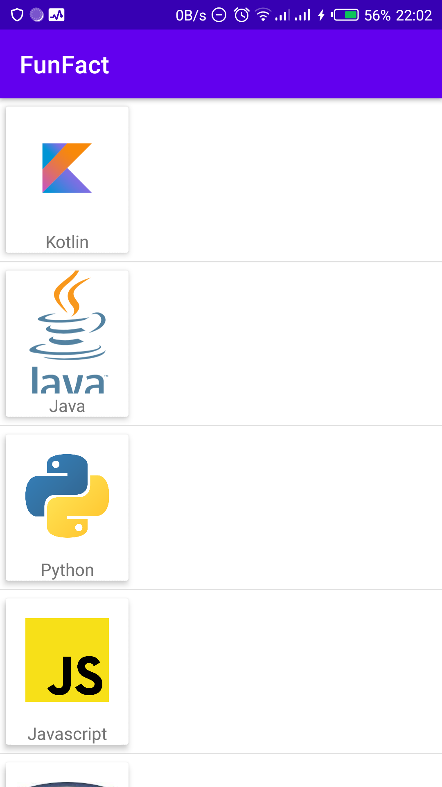
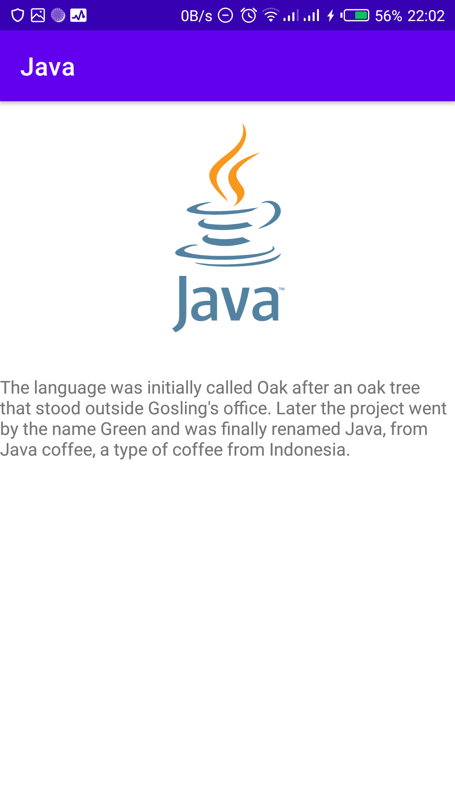

# FunFact
## This app is to demonstrate the use of ListView with Custom adapter in Kotlin

# Screenshots 
<table>
    <tr>
      <td>
        
      </td>
      <td>
         
      </td>
  </tr>
</table>

